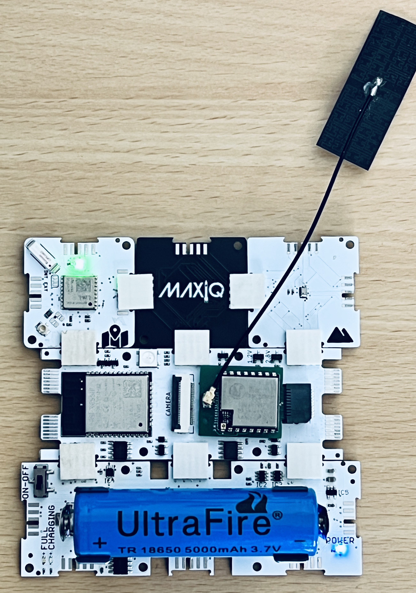
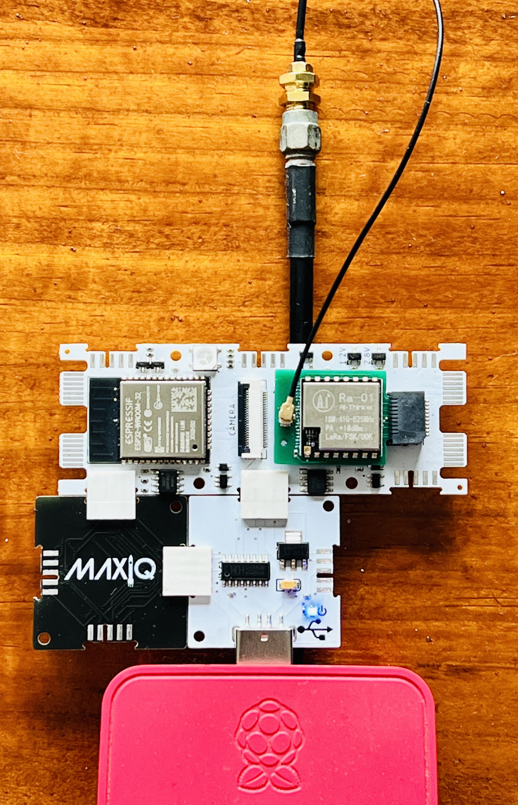

# Atmospheric-Sounding
This is a quick little project involving a flight station (FS), which has a GNSS and a barometer onboard. It send the data using LoRa to a ground station (GS), which in turn prints out the data to the serial porrt. Here is also a Python program that takes that data and generate a one-line .csv file for all the data.

## Flight Station

### Components

* Core:  [CWV](https://github.com/domino4com/CWV) 
* Radio: [EL4](https://github.com/domino4com/ELx)
* GNSS:  [INA](https://github.com/domino4com/INA)
* Barometer: [IWB](https://github.com/domino4com/IWB)

Firmware in the FS folder.

## Ground Station

### Components

* Core:  [CWV](https://github.com/domino4com/CWV) 
* Radio: [EL4](https://github.com/domino4com/ELx)
* USB: [PPU](https://github.com/domino4com/PPU)

Firmware in the GS folder.

### Python Program
This program, makecsv.py, just reads the data from the serial port and makes a .csv file. 

Usage: `python makecsv.py <serial-port> <csv file>`